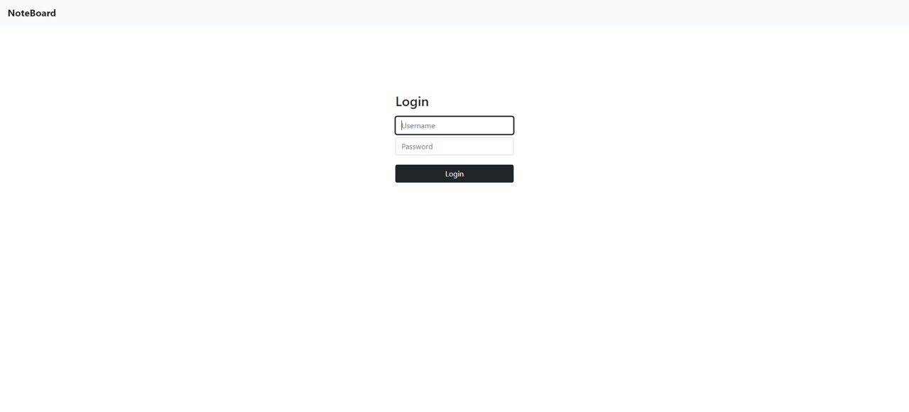
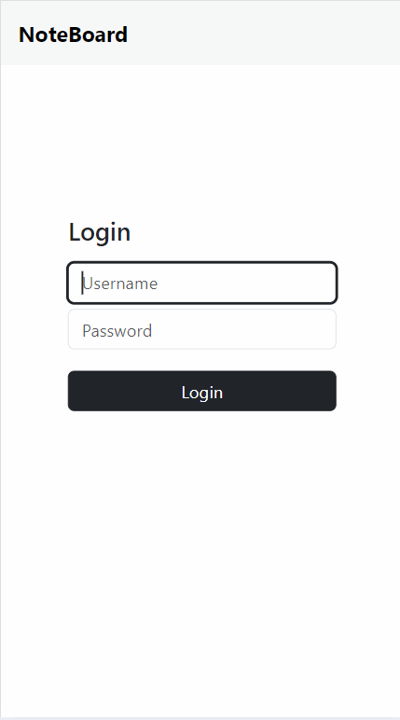

# NoteBoard

NoteBoard is a dynamic note-taking web application inspired by Google Keep. It allows users to create, edit, and organize sticky notes in a user-friendly interface. Notes can be customized with different colors and images, and users have the ability to create, update, and delete their notes.

## Features

- **User Authentication:** Secure login system to access and manage personal notes.
- **Edit Notes:** Users can freely edit the title and body of their sticky notes.
- **Customize Appearance:** Options to change the color schemes of notes and add images to them.
- **Responsive Design:** Optimized for both desktop and mobile devices.

## Technology Stack

- Backend: Express.js, MongoDB
- Frontend: React.js, Bootstrap
- Authentication: JWT (JSON Web Tokens)
- Deployment: Docker, NGINX

## Installation

1. Clone the repository:
   ```bash
   git clone https://github.com/ChenToaff/NoteBoard.git
   cd NoteBoard
   ```
2. Build and run the Docker containers:
   ```bash
   docker-compose up --build
   ```

## Usage

1. Open your web browser and navigate to `http://localhost:3000` to access the NoteBoard application.
2. Log in with:

   - Username: `admin` (Can be configured with `ADMIN_USERNAME`).
   - Password: `admin` (Can be configured with `ADMIN_PASSWORD`).

3. Explore the board and interact with the notes.

## Screenshots

### Desktop



### Mobile


